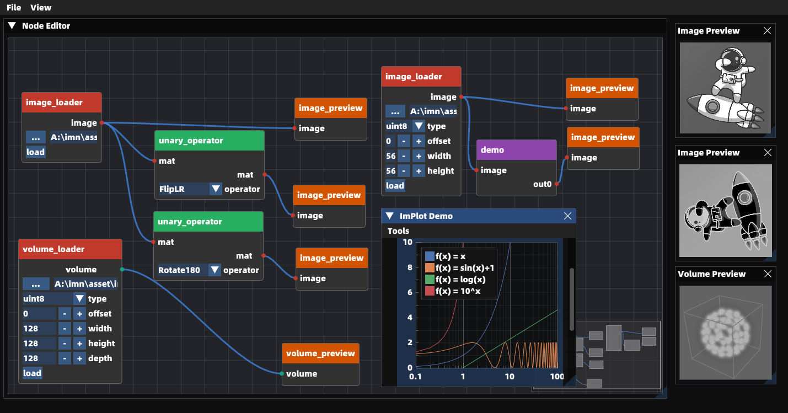

## Project Introduction

imn is a low code platform for image / volume processing. it is designed to provide a simple and easy-to-use interface for users to manipulate & preview for both 2d & 3d data.

## Features

- 2d / 3d data playground based on node editor
- beautiful plot ui via implot
- 2d data preview via implot
- 3d data preview via vtk
- workflow save & dump
- workflow graph minimap
- support for custom python node via plugin system
- third party python packages support (support numpy by default)
- i18n supported

## Custom Node

you can easily create your own node by adding a python script file to the `python/nodes` folder. the script file should contain a `run` function. imn will automatically register a node with input and output pins via inspecting the type hints of the `run()` function.

the following is an example of a custom node that transposes an image and then inverts its color. you can find this example in `python/nodes/demo.py`.

```python
# demo.py
import numpy as np

def run(image: np.ndarray) -> tuple[np.ndarray]:
    rv = np.transpose(image)
    rv = 255 - rv
    return (rv,)
```

## Screenshot



## TODO

- [x] add more built-in nodes
- [x] add support for i18n
- [x] add image interaction
- [x] add volume interaction
- [ ] add volume segmentation
- [x] add support for 4k screen
- [x] add support for python node
- [ ] batch node processing

